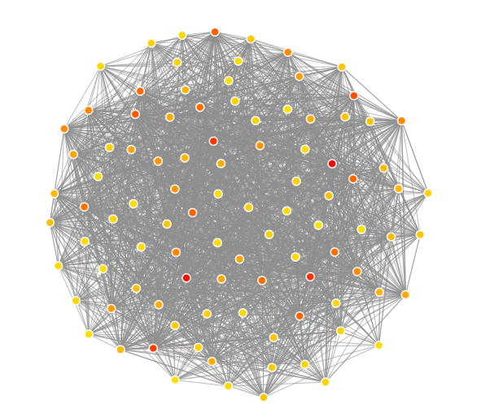

# GraphX Tennis Stats

Using ATP Tennis stats from [Jeff Sackmann](https://github.com/JeffSackmann/tennis_atp/)

### Hypothesis

**Observation:** In roughly 1/3 of the ATP tennis matches simply looking at the official ATP ranking would imply a wrong outcome.

The approach taken in this attempt is to model the occurrences of matches as a graph and infer the relative strengths of players
based on their relationship to one another.

